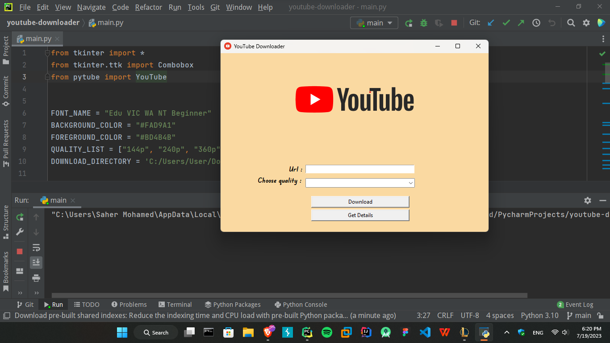

# YouTube Video Downloader
A simple Python application that allows you to download YouTube videos by providing a URL and selecting the desired video quality.

## Requirements
- Python 3.x
- `tkinter` library
- `pytube` library

## Usage
1. Run the application using Python.
2. Enter the YouTube video URL in the provided entry field.
3. Choose the desired video quality from the drop-down list.
4. Click the "Download" button to download the video to the specified download directory.
5. Click the "Get Details" button to view additional details about the video, such as name, length, publish date, views, and description.

**Note:** The application downloads the video in the selected quality and saves it to the default download directory. Make sure you have the necessary permissions to write to the download directory.

## Configuration
- You can modify the following constants in the youtube_downloader.py file to customize the application:
    - `FONT_NAME`: The font used for various UI elements.
    - `BACKGROUND_COLOR`: The background color of the application.
    - `FOREGROUND_COLOR`: The foreground color of the text elements.
    - `QUALITY_LIST`: The list of available video quality options.
    - `DOWNLOAD_DIRECTORY`: The default download directory for saving downloaded videos.

## Screenshot

